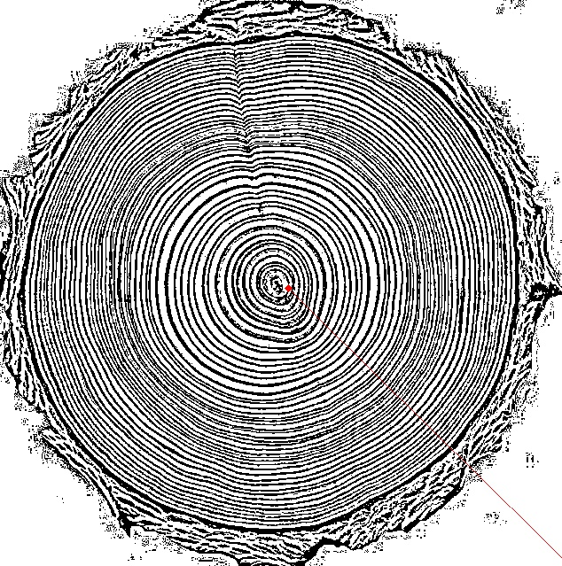

# Tree Age
Age estimation from tree rings.

## How to use?
[Tree Age](46.101.211.40) Click me!

## Install
- TODO

### Orginal Image

### processed picture

## The technologies I use
- Bootle
- Opencv2
- Numpy
- Imgur
