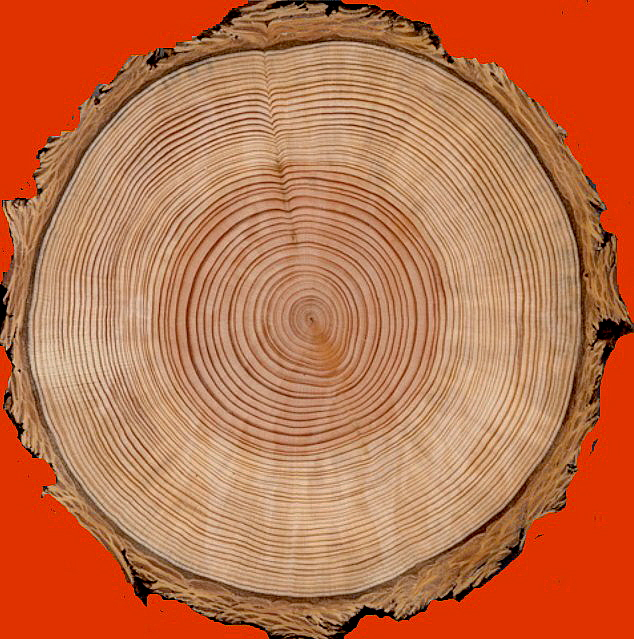
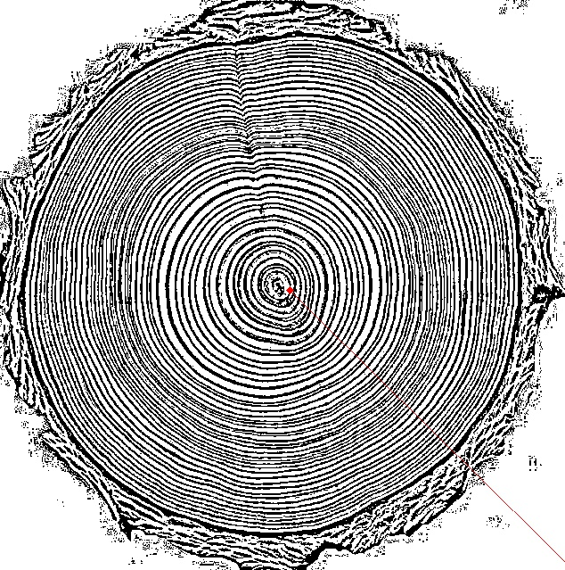

# Tree Age
It was simply created to measure tree age. The picture was processed with Opencv. Image was uploaded with Bottle simple web library. The project needs theoretical support to make it better. I do not have theoretical knowledge.

## Install
    $ git clone https://github.com/tolgahanuzun/treeage
    $ cd treeage
    $ virtualenv -p python3 .
    $ source bin/activate
    $ pip install -r requirements.txt
 And
    
    $ python server.py

### Orginal Image

### Processed picture

## The technologies I use
- Flask
- Opencv2
- Numpy
- Imgur
